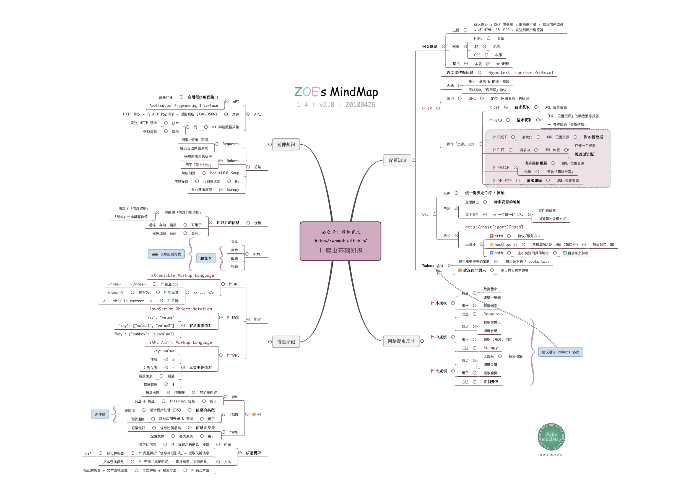
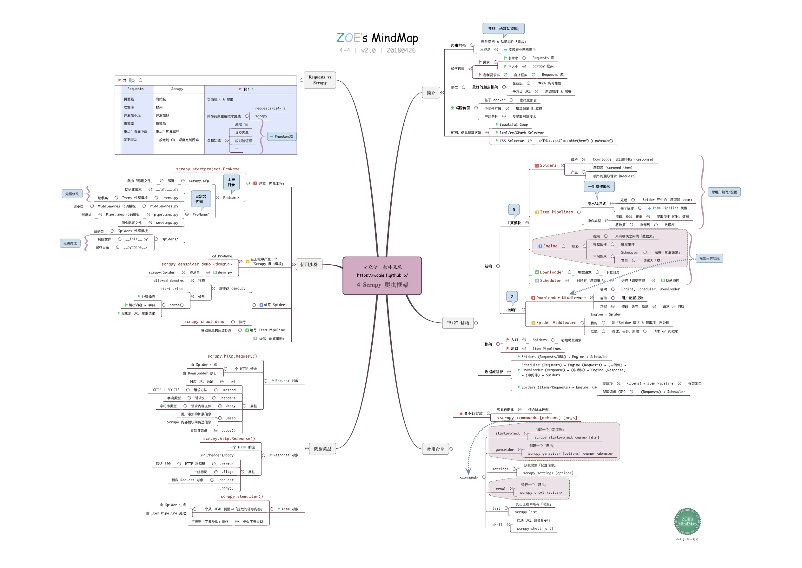

# Python 爬虫

这次给大家带来的是**4 幅思维导图，梳理了 Python 爬虫部分核心知识点：网络基础知识，Requests，BeautifulSoup，urllib 和 Scrapy 爬虫框架**。

爬虫是一个非常有趣的主题，ZOE 正是通过爬虫完成了我的课题所需数据的原始积累。第一次抓到数据时，感觉世界都明亮了呢~

自从体会到学习编程极大减少工作量的快感，深深的为程序员的「懒惰」美德着迷，再也回不去电脑小白的蠢萌岁月啦，哈哈。

当然，由于日常项目要求不高，本文思维导图仅仅涉及了爬虫最核心基础的部分，但足够应对你的入门所需了~

P.S.由于平台对图片有一定程度的压缩，**建议下载高清原图（见文末），放大后阅读**。
**工具：XMind**

## ▍思维导图

**1 爬虫基础知识**

## ▍参考资料

如果你希望进一步学习表单提交，JS 处理，验证码等更高阶的话题，可以继续深入学习本文附上的参考资料哦~
MOOC：Python 网络爬虫与信息提取
书籍：《Python 网络数据采集》

**若发现本篇 Python 笔记有错误，希望大家能在公众号后台给我留言，注明「#错误」，方便我统一进行处理**。若有内容纠错更新，会在每周末给大家群发消息，告知新的思维导图下载链接哦~

## ▍如何下载
三种方式均可获得高清原图及 PDF 版下载链接（公众号：数林觅风，ID：zoemindmap）：

❥ 公众号找到本文 → 左下角「阅读原文」→ 提取文件（密码：f0o3）

❥ 公众号后台回复关键词「Python」

❥ 进入公众号目录「导图下载」→ Python-R

**小伙伴们，点个赞鼓励一下 ZOE 妹子哦，比心~** ❤ 

