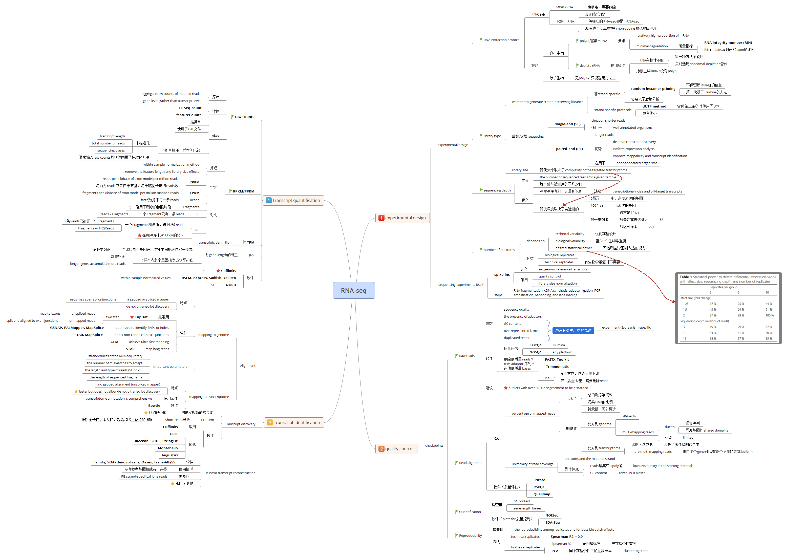

* content
{:toc}

这段时间阅读了一篇关于RNA-seq数据分析流程的文献，文章虽然还不错，但信息量很大，初看可能会有点混乱，把握不住重点。为了更好的理清楚脉络，我把它总结成了思维导图，分享给大家。这样一来，文章的结构就很清晰了。

默认阅读顺序：从右→左，顺时针方向。

### 分析流程

### 参考资料
2016_Genome Biology_A survey of best practices for RNA-seq data analysis